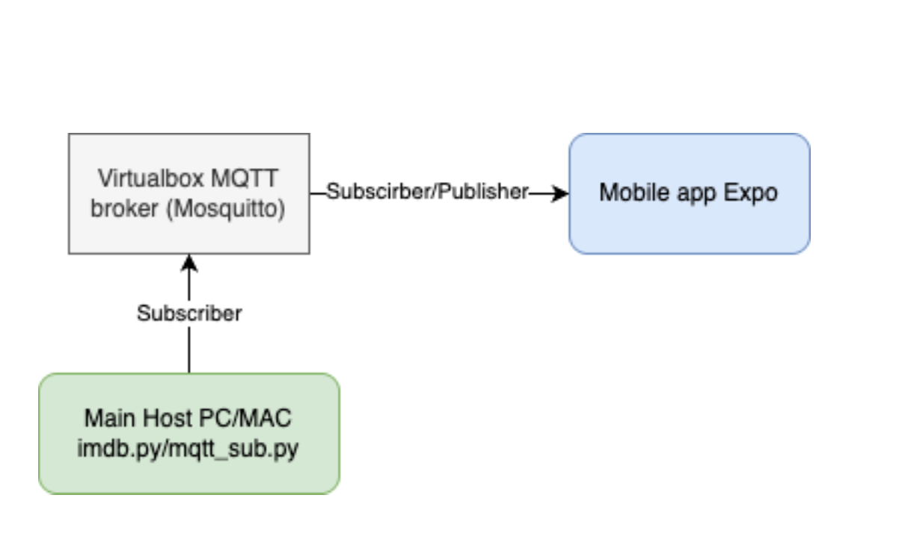

# EXPO and MQTT Integration

## Overview

This project demonstrates the integration between an EXPO mobile application and an MQTT broker (Mosquitto) with a Python backend subscriber. The system allows sending messages from the EXPO mobile app to the MQTT broker, which are then processed by a Python backend to perform specific actions such as opening browser windows and triggering searches.

## System Architecture



The system consists of three main components:
1. **EXPO Mobile Application** - Frontend for sending messages
2. **Mosquitto MQTT Broker** - Message broker running on Ubuntu in VirtualBox
3. **Python Backend** - Subscriber that listens to messages and executes actions

## Prerequisites

- VirtualBox
- Ubuntu Server (installation image from osboxes.org or ubuntu.com)
- MQTTX (for testing)
- Node.js and npm
- Expo CLI
- Python 3.x with required packages

## Installation and Setup

### 1. Setting up the Ubuntu VirtualBox Container

1. Download Ubuntu Server image:
   - For Windows: https://www.osboxes.org/ubuntu-server/
   - For macOS: https://cdimage.ubuntu.com/releases/noble/release/

2. Import the image into VirtualBox and configure network settings to ensure SSH access

3. Start the VM and connect via SSH

4. Run the following commands to install and configure Mosquitto:
   ```bash
   sudo apt update && sudo apt upgrade -y
   sudo apt install mosquitto mosquitto-clients vim -y
   sudo systemctl enable mosquitto
   sudo systemctl start mosquitto
   ```

5. Configure Mosquitto by editing `/etc/mosquitto/mosquitto.conf`:
   ```bash
   sudo vim /etc/mosquitto/mosquitto.conf
   ```
   
   Add the following configuration:
   ```
   # Place your local configuration in /etc/mosquitto/conf.d/
   #
   # A full description of the configuration file is at
   # /usr/share/doc/mosquitto/examples/mosquitto.conf.example
   
   pid_file /run/mosquitto/mosquitto.pid
   
   listener 1883
   
   listener 8000
   protocol websockets
   
   allow_anonymous true
   
   persistence true
   persistence_location /var/lib/mosquitto/
   
   log_dest file /var/log/mosquitto/mosquitto.log
   
   include_dir /etc/mosquitto/conf.d
   ```

6. Restart Mosquitto to apply the new configuration:
   ```bash
   sudo systemctl restart mosquitto
   ```

7. Verify that Mosquitto is running and listening on the correct ports:
   ```bash
   sudo apt install net-tools
   sudo netstat -tulnp | grep mosquitto
   ```

8. Get the IP address of your VM to use for connections:
   ```bash
   ip r
   ```

### 2. Setting Up the EXPO Application

1. Extract the provided EXPO application from Moodle

2. Navigate to the EXPO app directory and modify the MQTT connection settings:
   - Find the Paho MQTT server configuration in the code
   - Update the connection address to point to your VM's IP address
   - Ensure that port 8000 is specified for the WebSocket connection

3. Install dependencies and start the EXPO app:
   ```bash
   npm install
   npx expo start
   ```

4. Test the connection by sending messages from the EXPO app

### 3. Setting Up the Python Backend

1. Copy the provided Python files (`imdb.py` and `mqtt_sub.py`) to your working directory

2. Install required Python packages:
   ```bash
   pip install paho-mqtt
   ```

3. Modify the Python files as needed with your MQTT broker details:
   ```python
   # mqtt_sub.py
   MQTT_BROKER = "YOUR_VM_IP_ADDRESS"
   MQTT_PORT = 1883
   ```

4. Run the Python subscriber:
   ```bash
   python mqtt_sub.py
   ```

## Usage

1. Ensure all components are running:
   - Mosquitto MQTT broker on the Ubuntu VM
   - EXPO application
   - Python subscriber

2. Use the EXPO app interface to send messages

3. The messages will be received by the MQTT broker and forwarded to the Python subscriber

4. The Python backend will perform the configured actions (e.g., opening browser windows, triggering searches)

5. For testing, you can also use MQTTX to publish messages on matching topics

## Connection Differences: Port 1883 vs Port 8000

- **Port 1883**:
  - Standard MQTT protocol port
  - Uses TCP/IP connection
  - More efficient for machine-to-machine communication
  - Used by the Python backend subscriber

- **Port 8000**:
  - WebSocket protocol (MQTT over WebSockets)
  - Required for web browsers and mobile applications that cannot directly use TCP connections
  - Allows MQTT functionality in web environments
  - Used by the EXPO mobile application

## File Structure

```
project/
├── expo-app/                  # EXPO mobile application
│   ├── App.js                 # Main application file
│   ├── package.json           # Dependencies
│   └── ...                    # Other EXPO app files
│
├── python-backend/            # Python subscriber backend
│   ├── mqtt_sub.py            # MQTT subscriber implementation
│   ├── imdb.py                # IMDB search functionality
│   └── ...                    # Other Python scripts
│
└── README.md                  # This file
```

## Troubleshooting

- **Connection Issues**: 
  - Ensure the VM's IP address is correctly set in all components
  - Verify that ports 1883 and 8000 are open and not blocked by firewalls
  - Check that the network (phone hotspot) is properly configured

- **Message Delivery Problems**:
  - Confirm that the topics match between publishers and subscribers
  - Use MQTTX to test the broker directly

- **EXPO App Issues**:
  - Check for console errors when starting the app
  - Verify WebSocket connection parameters

## Contributing

This project was completed as part of a laboratory assignment. For any suggestions or improvements, please contact the repository owner.

## License

This project is used for educational purposes and follows the licensing terms of its dependencies.

## Acknowledgments

- The EXPO application template provided through Moodle
- The Python examples provided for the backend functionality
